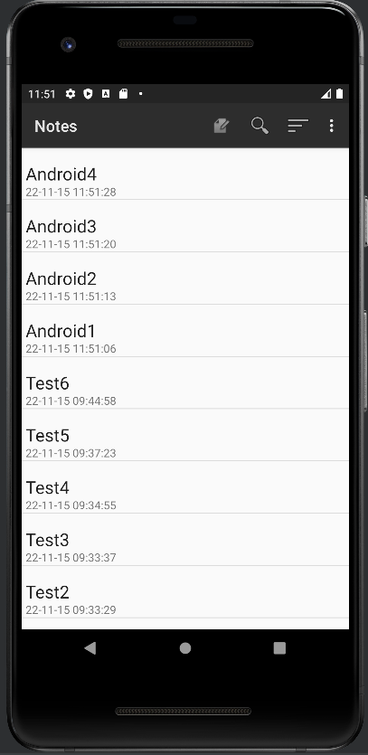
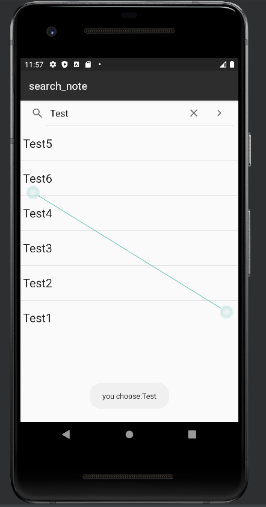
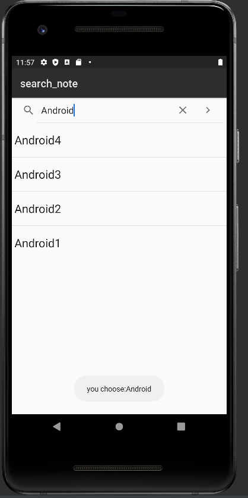
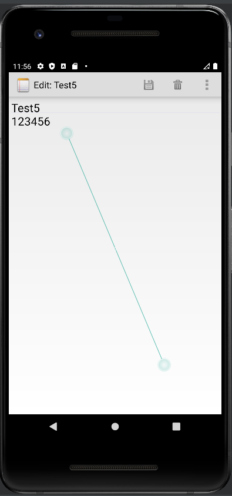
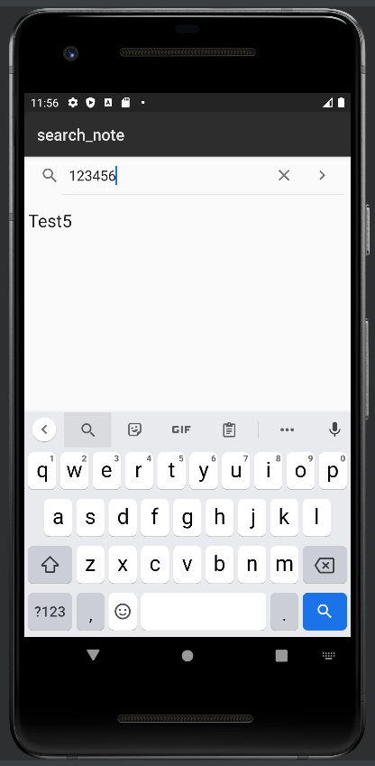
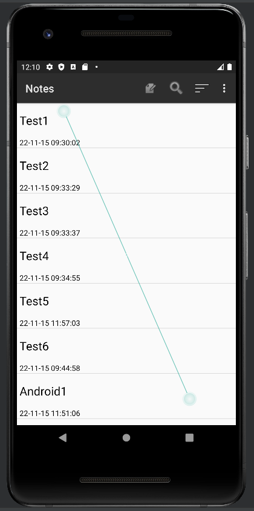
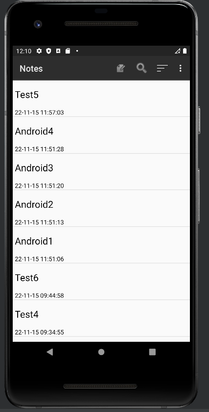
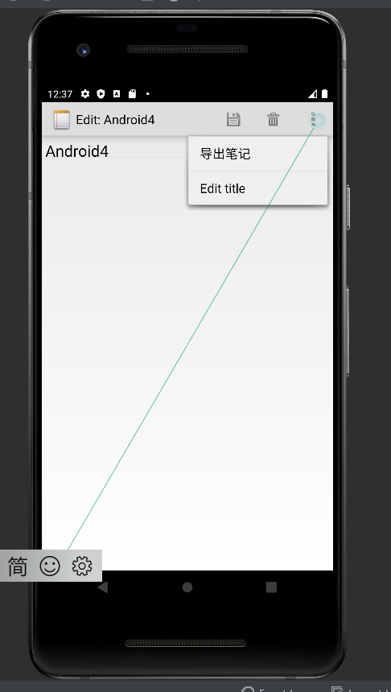
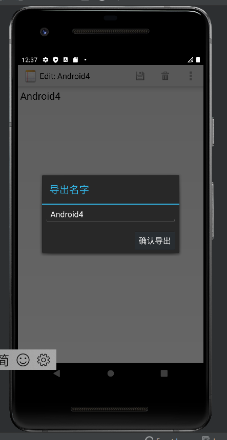
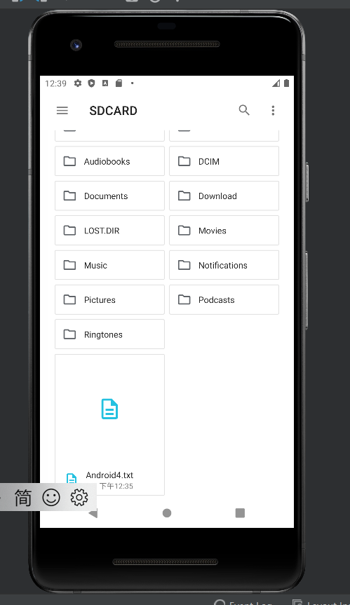

# Android-MidTest NotePad 记事本应用

### 基础功能

#### （1）时间戳

①layout 文件中 noteist_item 文件是显示笔记中每条记录的，目前只有一个 TextView 拿来显示标题，想要给对应笔记条目增加时间戳必须再加入一个 TestView 拿来显示时间(这里把时间戳设在了底部)

```
<TextView
        android:id="@+id/text2"
        android:layout_width="match_parent"
        android:layout_height="wrap_content"
        android:layout_alignParentStart="true"
        android:layout_alignParentTop="true"
        android:layout_marginTop="45dp"
        android:gravity="center_vertical"
        android:paddingLeft="5dip"
        android:singleLine="true" />
```

② 修改时间格式，在 NotePadProvider 中是存在时间变量的（
Long now = Long.valueOf(System.currentTimeMillis());），但是是以 Long 型变量来定义从 1970-1-01 00:00:00.000 到当前时刻的时间距离，不符合我们日常所用的 YY-MM-DD HH:MM:SS 表达，我们需要转换，修改 NotePadProvider 里 insert 的方法，使用 simpleDateFormat 修改为我们熟悉的格式

```
// Gets the current system time in milliseconds
        Long now = Long.valueOf(System.currentTimeMillis());
        //修改 需要将毫秒数转换为时间的形式yy.MM.dd HH:mm:ss
        Date date = new Date(now);
        SimpleDateFormat simpleDateFormat = new SimpleDateFormat("yy-MM-dd HH:mm:ss");
        String dateFormat = simpleDateFormat.format(date);//转换为yy.MM.dd HH:mm:ss形式的时间
        // If the values map doesn't contain the creation date, sets the value to the current time.
        if (values.containsKey(NotePad.Notes.COLUMN_NAME_CREATE_DATE) == false) {
            values.put(NotePad.Notes.COLUMN_NAME_CREATE_DATE, dateFormat);
        }

        // If the values map doesn't contain the modification date, sets the value to the current
        // time.
        if (values.containsKey(NotePad.Notes.COLUMN_NAME_MODIFICATION_DATE) == false) {
            values.put(NotePad.Notes.COLUMN_NAME_MODIFICATION_DATE, dateFormat);
        }
```

③ 默认时间修改完后，当我们修改笔记需要更新笔记修改时间那么 NoteEditor 的 update 函数时间样式也需要修改,和 ② 一样使用 simpleDateFormat 修改

```
ContentValues values = new ContentValues();
        long now = System.currentTimeMillis();
        Date date = new Date(now);
        SimpleDateFormat simpleDateFormat = new SimpleDateFormat("yy-MM-dd HH:mm:ss");
        String dateFormat = simpleDateFormat.format(date);
        values.put(NotePad.Notes.COLUMN_NAME_MODIFICATION_DATE, dateFormat);
```

④ 获取了时间我们现在需要把时间显示出来，首先是我们的数据表中需要有笔记创建时间和笔记修改时间这两列，在 NotePadProvier 内可以看到默认表中是已经存在了（NotePad.Notes.COLUMN_NAME_CREATE_DATE/NotePad.Notes.COLUMN_NAME_MODIFICATION_DATE）

```
public void onCreate(SQLiteDatabase db) {
           db.execSQL("CREATE TABLE " + NotePad.Notes.TABLE_NAME + " ("
                   + NotePad.Notes._ID + " INTEGER PRIMARY KEY,"
                   + NotePad.Notes.COLUMN_NAME_TITLE + " TEXT,"
                   + NotePad.Notes.COLUMN_NAME_NOTE + " TEXT,"
                   + NotePad.Notes.COLUMN_NAME_CREATE_DATE + " INTEGER,"
                   + NotePad.Notes.COLUMN_NAME_MODIFICATION_DATE + " INTEGER"
                   + ");");
       }
```

接下来需要把他投影出来，我这选的是显示修改后时间即（NotePad.Notes.COLUMN_NAME_MODIFICATION_DATE），修改 NoteList 内的 PROJECTION 函数

```
private static final String[] PROJECTION = new String[] {
            NotePad.Notes._ID, // 0
            NotePad.Notes.COLUMN_NAME_TITLE, // 1
            NotePad.Notes.COLUMN_NAME_MODIFICATION_DATE,//添加修改时间
    };
```

⑤PROJECTION 只是定义了需要被取出来的数据列，而之后用 Cursor 进行数据库查询，再之后用 Adapter 进行装填。看完源码之后，Cursor 不用变化，我们需要将显示列 dataColumns 和他们的 viewIDs 加入修改时间这一属性

```
String[] dataColumns = { NotePad.Notes.COLUMN_NAME_TITLE};
int[] viewIDs = { android.R.id.text1 };
```

```
String[] dataColumns = { NotePad.Notes.COLUMN_NAME_TITLE, NotePad.Notes.COLUMN_NAME_MODIFICATION_DATE }//加入修改时间;
int[] viewIDs = { android.R.id.text1, R.id.text2 }//加入修改时间;

```

⑥ 运行就能看到显示时间啦  


#### （2）搜索功能

① 首先为了 UI 美观我们在导航条里加一个放大镜图标安卓系统资源内是自带放大镜图片，不需要再去找一个放大镜图标了；在 menu 文件中 list_options_menu 中添加一个 item 放搜索图标

```
<item
        android:id="@+id/menu_search"
        android:icon="@android:drawable/ic_menu_search"
        android:title="@string/menu_search"
        android:showAsAction="always" />
```

② 搜索需要一个导航条以及搜索出的结果需要以 ListView 逐条呈现出来，需要在 layout 文件夹下新增一个 note_search 布局文件加入上述两个元素

```
<LinearLayout xmlns:android="http://schemas.android.com/apk/res/android"
    android:layout_width="match_parent"
    android:layout_height="match_parent"
    android:orientation="vertical">
    <SearchView
        android:id="@+id/search_view"
        android:layout_width="match_parent"
        android:layout_height="wrap_content"
        android:iconifiedByDefault="false"
        android:queryHint="搜索">
    </SearchView>
    <ListView
        android:id="@+id/list_view"
        android:layout_width="match_parent"
        android:layout_height="wrap_content"
        >
    </ListView>
</LinearLayout>

```

③ 在 java 文件下 NoteList.java 找到 public boolean onOptionsItemSelected(MenuItem item)函数增加一个 menu_search 图标的点击选择事件

```
case R.id.menu_search:
                Intent intent = new Intent();
                intent.setClass(this, NoteSearch.class);
                this.startActivity(intent);
                return true;
```

④ 第三步有个 NoteSearch.class 我们需要新建 NoteSearch.java
用到 PROJECTION 投影取出数据库中笔记的标题和修改时间

```
private static final String[] PROJECTION = new String[]{
            NotePad.Notes._ID, // 0
            NotePad.Notes.COLUMN_NAME_TITLE, // 1
            NotePad.Notes.COLUMN_NAME_MODIFICATION_DATE//时间
    };
```

搜索完成后跳出提示你选择了：搜索内容

```
public boolean onQueryTextSubmit(String query) {
        Toast.makeText(this, "you choose:"+query, Toast.LENGTH_SHORT).show();
        return false;
    }
```

添加 onCreate 函数打开 layout 布局文件中 note_search 界面，并且完成
获取 listview、对数据库进行操作、获取搜索视图的作用

```
protected void onCreate(Bundle savedInstanceState) {
        super.onCreate(savedInstanceState);
        setContentView(R.layout.note_search);
        SearchView searchView = findViewById(R.id.search_view);
        Intent intent = getIntent();
        if (intent.getData() == null) {
            intent.setData(NotePad.Notes.CONTENT_URI);
        }
        listView = findViewById(R.id.list_view);
        sqLiteDatabase = new NotePadProvider.DatabaseHelper(this).getReadableDatabase();
        //设置搜索视图以显示搜索按钮
        searchView.setSubmitButtonEnabled(true);

        //设置此搜索视图中默认显示的提示文本
        searchView.setQueryHint("search");
        searchView.setOnQueryTextListener(this);

    }
```

最后实现模糊查询，通过标题或者内容进行查询，具体看注释

```
public boolean onQueryTextChange(String string) {//Test改变的时候执行的内容
        String selection1 = NotePad.Notes.COLUMN_NAME_TITLE+" like ? or "+NotePad.Notes.COLUMN_NAME_NOTE+" like ?";//查询条件
        String[] selection2 = {"%"+string+"%","%"+string+"%"};//查询条件参数，配合selection参数使用,%通配多个字符
        //查询数据库中的内容,当我们使用 SQLiteDatabase.query()方法时，就会得到Cursor对象， Cursor所指向的就是每一条数据。
        //managedQuery(Uri, String[], String, String[], String)等同于Context.getContentResolver().query()
        Cursor cursor = sqLiteDatabase.query(
                NotePad.Notes.TABLE_NAME,
                PROJECTION, // 查询返回的列
                selection1,// 作为查询的过滤参数，也就是过滤出符合selection的数据，类似于SQL的Where语句之后的条件选择
                selection2,// 查询条件参数，配合selection参数使用
                null,
                null,
                NotePad.Notes.DEFAULT_SORT_ORDER // Use the default sort order.查询结果的排序方式，按照某个columns来排序，例：String sortOrder = NotePad.Notes.COLUMN_NAME_TITLE
        );
        String[] dataColumns = {
                NotePad.Notes.COLUMN_NAME_TITLE,
                NotePad.Notes.COLUMN_NAME_MODIFICATION_DATE
        } ;
        int[] viewIDs = {
                android.R.id.text1,
                android.R.id.text2
        };
        //一个简单的适配器，将游标中的数据映射到布局文件中的TextView控件或者ImageView控件中
        SimpleCursorAdapter adapter
                = new SimpleCursorAdapter(
                this,//context:上下文
                R.layout.noteslist_item, //layout:布局文件，至少有int[]的所有视图
                cursor,//cursor：游标
                dataColumns,//绑定到视图的数据
                viewIDs//用来展示from数组中数据的视图
        );
        listView.setAdapter(adapter);
        return true;
    }
```

⑤ 运行就可以实现搜索了（有个缺陷是搜索结果不能点击查看笔记内容）  
  
  
还可以实现内容查找  
  


### 其他功能

#### （1）笔记排序（按创建时间或者修改时间排序）

① 首先为了 UI 美观我们在导航条里加一个排序图标，安卓系统资源内是自带排序图片，不需要再去找一个排序图标了；在 menu 文件中 list_options_menu 中添加一个 item 放排序图标，同时因为有按照创建时间和修改时间两种排序方法需要在 item 内嵌套一个 menu 菜单菜单内放置两个 item 作为两种方法的选择

```
<item
        android:id="@+id/menu_sort"
        android:title="@string/menu_sort"
        android:icon="@android:drawable/ic_menu_sort_by_size"
        android:showAsAction="always" >
        <menu>
            <item
                android:id="@+id/menu_sort1"
                android:title="@string/menu_sort1"/>
            <item
                android:id="@+id/menu_sort2"
                android:title="@string/menu_sort2"/>
        </menu>
    </item>
```

② 在 NoteList.java:onOptionsItemSelected 添加对应的 case

```
  //创建时间排序
            case R.id.menu_sort1:
                cursor = managedQuery(
                        getIntent().getData(),
                        PROJECTION,
                        null,
                        null,
                        NotePad.Notes._ID
                );
                adapter = new SimpleCursorAdapter(
                        this,
                        R.layout.noteslist_item,
                        cursor,
                        dataColumns,
                        viewIDs
                );
                setListAdapter(adapter);
                return true;
            //修改时间排序
            case R.id.menu_sort2:
                cursor = managedQuery(
                        getIntent().getData(),
                        PROJECTION,
                        null,
                        null,
                        NotePad.Notes.DEFAULT_SORT_ORDER
                );
                 adapter = new SimpleCursorAdapter(
                        this,
                        R.layout.noteslist_item,
                        cursor,
                        dataColumns,
                        viewIDs
                );
                setListAdapter(adapter);
                return true;
```

③ 运行结果  
按创建时间排序  
  
按最后修改时间排序  


#### （2）导出笔记

① 长按笔记或者在笔记编辑界面我们可以选择导出笔记，所以我们要在上下文菜单中即
editor_options_menu.xml 文件中添加一个添加一个导出笔记的选项

```
<item android:id="@+id/menu_output"
        android:title="@string/menu_output" />
```

②NoteEditor.java 中 onOptionsItemSelected()方法添加对应的 case

```
 //导出笔记选项
        case R.id.menu_output:
                outputNote();
                break;
```

③ 在 NoteEditor.java 编写第二步的 outputNote()函数
跳转导出笔记的 activity，将 uri 信息传到新的 activity

```

private final void outputNote() {
        Intent intent = new Intent(null,mUri);
        intent.setClass(NoteEditor.this,OutputText.class);
        NoteEditor.this.startActivity(intent);
    }
```

④ 为第三步的 OutputText.class 创建一个 OutputText.java
首先要使用数据库内的信息用到 PROJECTION 投影取出数据库中笔记的标题、笔记内容、修改时间、创建时间

```
private static final String[] PROJECTION = new String[] {
            NotePad.Notes._ID, // 0
            NotePad.Notes.COLUMN_NAME_TITLE, // 1
            NotePad.Notes.COLUMN_NAME_NOTE, // 2
            NotePad.Notes.COLUMN_NAME_CREATE_DATE, // 3
            NotePad.Notes.COLUMN_NAME_MODIFICATION_DATE, // 4
    };
```

读取出的值放入这些变量、读取该笔记信息、导出文件的名字、NoteEditor 传入的 uri，用于从数据库查出该笔记、关于返回与保存按钮的一个特殊标记，返回的话不执行导出，点击按钮才导出

```
//读取出的值放入这些变量
    private String TITLE;
    private String NOTE;
    private String CREATE_DATE;
    private String MODIFICATION_DATE;
    //读取该笔记信息
    private Cursor mCursor;
    //导出文件的名字
    private EditText mName;
    //NoteEditor传入的uri，用于从数据库查出该笔记
    private Uri mUri;
    //关于返回与保存按钮的一个特殊标记，返回的话不执行导出，点击按钮才导出
    private boolean flag = false;
    private static final int COLUMN_INDEX_TITLE = 1;
```

onCreate 函数唤醒 Activitty 并且打开 layout 文件中 output_text.xml（导出确认框），并且读取出选中笔记的信息以及文件的名字（默认为笔记标题）

```

public void onCreate(Bundle savedInstanceState) {
        super.onCreate(savedInstanceState);
        setContentView(R.layout.output_text);
        mUri = getIntent().getData();
        mCursor = managedQuery(
                mUri,        // The URI for the note that is to be retrieved.
                PROJECTION,  // The columns to retrieve
                null,        // No selection criteria are used, so no where columns are needed.
                null,        // No where columns are used, so no where values are needed.
                null         // No sort order is needed.
        );
        mName = (EditText) findViewById(R.id.output_name);
    }
    @Override
    protected void onResume(){
        super.onResume();
        if (mCursor != null) {
            // The Cursor was just retrieved, so its index is set to one record *before* the first
            // record retrieved. This moves it to the first record.
            mCursor.moveToFirst();
            //编辑框默认的文件名为标题，可自行更改
            mName.setText(mCursor.getString(COLUMN_INDEX_TITLE));
        }
    }
```

从 mCursor 读取出对应的值

```
@SuppressLint("Range")
    @Override
    protected void onPause() {
        super.onPause();
        if (mCursor != null) {
            //从mCursor读取对应值
            TITLE = mCursor.getString(mCursor.getColumnIndex(NotePad.Notes.COLUMN_NAME_TITLE));
            NOTE = mCursor.getString(mCursor.getColumnIndex(NotePad.Notes.COLUMN_NAME_NOTE));
            CREATE_DATE = mCursor.getString(mCursor.getColumnIndex(NotePad.Notes.COLUMN_NAME_CREATE_DATE));
            MODIFICATION_DATE = mCursor.getString(mCursor.getColumnIndex(NotePad.Notes.COLUMN_NAME_MODIFICATION_DATE));
            //flag在点击导出按钮时会设置为true，执行写文件
            if (flag == true) {
                write();
            }
            flag = false;
        }
    }
```

最后是写出文件,如果手机插入了 SD 卡，而且应用程序具有访问 SD 的权限,导出的文件为 txt 文件，包含文件题目，内容，创建时间，修改时间，并且通过 Toast 提示导出成功以及导出的位置

```
private void write()
    {
        try
        {
            // 如果手机插入了SD卡，而且应用程序具有访问SD的权限
            if (Environment.getExternalStorageState().equals(
                    Environment.MEDIA_MOUNTED)) {
                // 获取SD卡的目录
                File sdCardDir = Environment.getExternalStorageDirectory();
                //创建文件目录
                File targetFile = new File(sdCardDir.getCanonicalPath() + "/" + mName.getText() + ".txt");
                //写文件
                PrintWriter ps = new PrintWriter(new OutputStreamWriter(new FileOutputStream(targetFile), "UTF-8"));
                ps.println(TITLE);
                ps.println(NOTE);
                ps.println("创建时间：" + CREATE_DATE);
                ps.println("最后一次修改时间：" + MODIFICATION_DATE);
                ps.close();
                Toast.makeText(this, "保存成功,保存位置：" + sdCardDir.getCanonicalPath() + "/" + mName.getText() + ".txt", Toast.LENGTH_LONG).show();
            }
        }
        catch (Exception e)
        {
            e.printStackTrace();
        }
    }
```

⑤ 为了 UI 美观，增加一个导出确认框，在 layout 文件夹中创建一个 output_text.xml，一个可编辑框显示导出文件的文件名，一个确认按钮

```
<?xml version="1.0" encoding="utf-8"?>
<LinearLayout xmlns:android="http://schemas.android.com/apk/res/android"
    android:layout_width="wrap_content"
    android:layout_height="wrap_content"
    android:orientation="vertical"
    android:paddingLeft="6dip"
    android:paddingRight="6dip"
    android:paddingBottom="3dip">
    <EditText android:id="@+id/output_name"
        android:maxLines="1"
        android:layout_marginTop="2dp"
        android:layout_marginBottom="15dp"
        android:layout_width="wrap_content"
        android:ems="25"
        android:layout_height="wrap_content"
        android:autoText="true"
        android:capitalize="sentences"
        android:scrollHorizontally="true" />

    <Button android:id="@+id/output_ok"
        android:layout_width="wrap_content"
        android:layout_height="wrap_content"
        android:layout_gravity="right"
        android:text="@string/output_ok"
        android:onClick="OutputOk" />
</LinearLayout>
```

⑥AndroidManifest.xml 中将这个 Acitvity 主题定义为对话框样式，并且加入权限

```
        <activity android:name=".OutputText"
            android:label="@string/output_name"
            android:theme="@android:style/Theme.Holo.Dialog"
            android:windowSoftInputMode="stateVisible">
        </activity>
    </application>
    <!-- 在SD卡中创建与删除文件权限 -->
    <uses-permission android:name="android.permission.MOUNT_UNMOUNT_FILESYSTEMS"/>
    <!-- 向SD卡写入数据权限 -->
    <uses-permission android:name="android.permission.WRITE_EXTERNAL_STORAGE"/>
```

⑦ 运行结果  
  
  

